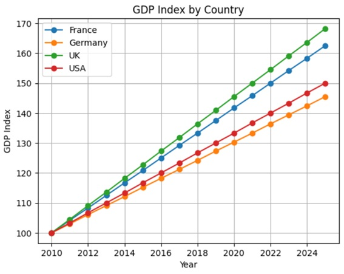
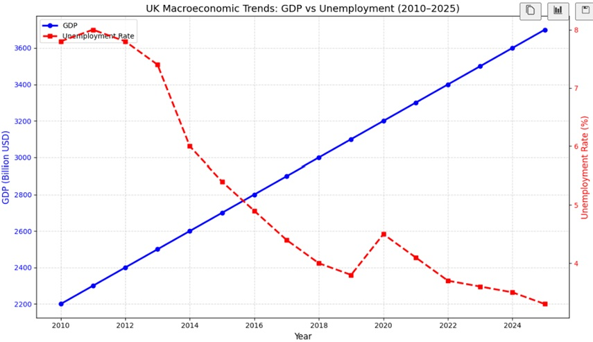

# 

## Executive Summary

### This project analyses the economic performance of the UK compared with key European peers (Germany and France) from 2010–2025, focusing on growth, unemployment, inflation, and economic resilience. Using Python, pandas, and seaborn, the analysis explores how national economic trends translate into labour market outcomes and what this means for local authorities responsible for skills, training, and economic development.

### The findings show that the UK experiences higher growth volatility, sharper inflation spikes, and weaker unemployment resilience than Germany and France. These patterns highlight the importance of strong vocational systems and industrial structures in supporting stable employment. For cities like Coventry and Swindon, the analysis reinforces a key message: regions with strong skills pipelines are better positioned to attract investment, support residents, and prepare for emerging sectors such as AI and green technologies.

## Project Overview

### This project investigates three core questions:
### 1.	How does the UK’s economic performance compare with Germany and France?
### 2.	Does UK economic growth effectively translate into lower unemployment?
### 3.	What do these national trends mean for local authorities responsible for skills and economic development?

### To answer these, the project uses:
### * Multi country macroeconomic data (2010–2025)
### * 10 analytical plots exploring growth, unemployment, inflation, volatility, and the misery index
### * A narrative linking economic indicators to workforce development and local authority responsibilities

# 

## Key Insights

### 1. Germany and France show stronger labour market resilience
### Both countries maintain lower and more stable unemployment than the UK, supported by:
### *	structured vocational systems
### *	stronger industrial bases
### *	coordinated skills pipelines

### 2. The UK’s growth is more volatile
### Volatility analysis shows the UK experiences larger swings in economic growth, making long term   planning harder for businesses and councils.

### 3. Inflation shocks hit the UK harder
### The misery index shows a sharp post-2022 spike driven by inflation volatility, putting greater pressure on households and local services.

### 4. Growth does not consistently reduce unemployment in the UK
### Dual axis analysis shows weak alignment between GDP growth and unemployment reduction — a sign of structural inefficiency.

# 

### 5. Skills are the bridge between national growth and local opportunity
## Cities and towns like Coventry and Swindon demonstrate how a strong skills base attracts major employers. The same principle applies to AI, automation, and green technologies.

## Why This Matters for Local Authorities
### Local authorities play a direct role in:
### •	workforce training
### •	adult education
### •	business support
### •	economic development
### •	cost of living assistance

### The analysis shows that economic volatility at the national level quickly becomes a local challenge, increasing demand for:
### •	reskilling programmes
### •	AI and green tech training
### •	support for unemployed residents
### •	targeted cost of living interventions
### Strong skills pipelines are essential for resilience.

## Methodology
### *	Data cleaning and type conversion
### * Derived metrics (e.g., misery index)
### * Grouped volatility calculations
### * Multi country comparisons
### * Dual axis and annotated plots
### * Insight driven narrative following Brent Dykes’ data storytelling principles
### * Dataset source used: Kaggle Economic Indicators and Inflation.

